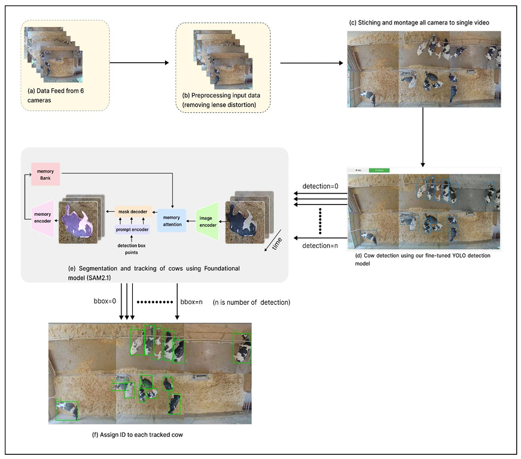

```{r setup, include=FALSE}
knitr::opts_chunk$set(echo = TRUE, warning = FALSE, message = FALSE)
library(knitr)
library(tidyverse)
library(readxl)
library(scales)
```


```{r logo, echo=FALSE, out.width = '50%', fig.align = "center", fig.cap="Logo  ISARA"}
knitr::include_graphics("logo isara.png")
```
\newpage
```{r imports, echo=FALSE, eval=TRUE}
read_excel("Impact quantitatif de la PLF sur la santé des animaux laitiers..xlsx" ,na = "NA") -> impact 

# Transformer en format long
impact %>%
  pivot_longer(cols = c(AV_PLF, AP_PLF),names_to = "Situation",values_to = "Valeur") -> data_long 

data_long %>%
  mutate(Parametre = factor(`...1`, levels = unique(`...1`)),angle = 90 - 360 * (as.numeric(Parametre)-1) / length(unique(Parametre))) ->radial_data 

impact %>%
  select(...1, AMELIO) %>%
  mutate(AMELIO = as.numeric(AMELIO), Parametre = factor(`...1`, levels = unique(`...1`))) ->impact_pct 

```

# I. Introduction
L’élevage bovin laitier connaît aujourd’hui une transformation profonde. Depuis longtemps, il est orienté vers l’optimisation des performances technico-économiques. Cependant, il doit désormais répondre à des attentes sociétales croissantes en matière de bien-être animal, de santé des troupeaux et de durabilité des systèmes de production[@veissier_elevage_2019] [@prost_key_2023]. Cette évolution marque une rupture progressive avec les modèles hérités de la révolution verte et impose une approche plus intégrée du fonctionnement des élevages.
Dans ce contexte, l’intelligence artificielle (IA) et l’élevage de précision (Precision Livestock Farming, PLF) occupent une place croissante. L’IA désigne ici l’ensemble des méthodes permettant à des systèmes numériques de collecter des données issues de capteurs, de les analyser à l’aide d’algorithmes (machine learning) et de produire des informations exploitables pour la gestion du troupeau [@mahtout_integration_2024]. Appliquée aux bâtiments d’élevage, l’IA vise à améliorer la surveillance des animaux, à anticiper les problèmes sanitaires et à optimiser les conditions d’ambiance.
L’enjeu dépasse toutefois la seule performance productive. Il s’agit de comprendre en quoi l’IA intégrée aux bâtiments d’élevage peut contribuer à une amélioration réelle du bien-être et de la santé des bovins laitiers, tout en identifiant les limites techniques, scientifiques et socio-éthiques qui conditionnent son efficacité et son acceptabilité.

# II. Infrastructures d’IA dans les bâtiments d’élevage et contributions au bien-être animal

## 1. Capteurs embarqués et suivi individualisé des animaux
Les infrastructures d’IA en élevage reposent en premier lieu sur des capteurs portés par les animaux. Les plus répandus sont les accéléromètres tri-axiaux, parfois intégrés à des unités de mesure inertielle (IMU), placés sur des colliers, des balises auriculaires ou des dispositifs podaux [@pesenti_rossi_systematic_2024].
Ces capteurs enregistrent en continu les mouvements de l’animal. Les données brutes sont ensuite analysées par des algorithmes d’apprentissage automatique capables de classifier les comportements tels que la marche, le repos, l’ingestion ou la rumination {@michelena_review_2025]. Ces comportements constituent des indicateurs indirects, mais robustes, de l’état de santé et du bien-être des bovins laitiers [@rutten_invited_2013].
L’un des apports majeurs de ces technologies réside dans le suivi individualisé et longitudinal. Contrairement aux méthodes traditionnelles d’évaluation du bien-être, qui reposent sur des observations ponctuelles à l’échelle du troupeau, l’IA permet de suivre chaque animal dans la durée [@veissier_elevage_2019]. Chaque vache devient ainsi son propre point de référence. Les algorithmes apprennent ses rythmes comportementaux habituels et détectent toute déviation significative, même subtile [@taghipoor_technologies_2025].
Cette individualisation est essentielle, car les réponses au stress, à la maladie ou aux contraintes environnementales varient fortement d’un individu à l’autre. L’IA améliore ainsi la sensibilité de la détection du mal-être, souvent bien avant que celui-ci ne soit perceptible à l’œil humain.

## 2. Détection précoce des troubles sanitaires et prévention de la souffrance

La santé et le bien-être des bovins laitiers sont étroitement liés. De nombreuses pathologies s’accompagnent de modifications comportementales précoces, qui peuvent être détectées par les infrastructures d’IA intégrées aux bâtiments.
Les maladies métaboliques, comme l’acidose subaiguë, se traduisent par une baisse de l’ingestion, une diminution du temps de rumination et une modification des périodes de repos. Les capteurs d’activité permettent d’identifier ces signaux faibles avant l’apparition de symptômes cliniques marqués [@veissier_elevage_2019][@taghipoor_technologies_2025]. Une intervention plus précoce limite la souffrance animale et réduit le recours à des traitements lourds.
Les mammites constituent un autre exemple emblématique. Elles induisent souvent des changements discrets de locomotion et une réduction du temps couché. En croisant plusieurs indicateurs comportementaux, les modèles d’IA améliorent la fiabilité des alertes sanitaires et favorisent une gestion plus préventive de la santé mammaire [@taghipoor_technologies_2025].
La détection des boiteries représente un enjeu central pour le bien-être. Les boiteries sont douloureuses, chroniques et fortement pénalisantes pour la qualité de vie des animaux. L’analyse des données issues des accéléromètres et des systèmes de localisation permet d’identifier des schémas caractéristiques : distances parcourues plus faibles, vitesse réduite, augmentation du temps de repos [@taghipoor_technologies_2025]. Cette approche est particulièrement pertinente dans les systèmes pâturants, où l’observation directe est difficile.

```{r graph1, echo=FALSE, eval=TRUE, fig.height = 5, fig.width = 5, fig.align = "center", fig.cap="Comparaison des indicateurs de santé et de production avant et après l’adoption du PLF."}
radial_data %>%
  ggplot +
  aes(x = Parametre, y = Valeur, fill = Situation) +
  
  geom_bar(stat = "identity", position = position_dodge(width = 0.8), width = 0.6) +
  
  coord_polar(start = 0) +
  geom_text(aes(label = Valeur),position = position_dodge(width = 0.8),vjust = -0.5, size = 4) +
 
  scale_fill_manual(values = c("AV_PLF" = alpha("red",0.5), "AP_PLF" = alpha("blue",0.5)),labels = c("AV_PLF" = "Avant PLF", "AP_PLF" = "Après PLF")) +
  labs(title = "Impact quantitatif de la PLF",
       subtitle = "Comparaison Avant et Après PLF",
       y = "Valeur", x = "") +
  theme_minimal(base_size = 14) +
  theme(axis.text.y = element_blank(),
        axis.ticks = element_blank(),
        panel.grid.minor = element_blank(),
        legend.position = "bottom")
```

Le graphique radial (Figure 2) [@franklin_impact_2025] illustre les valeurs absolues mesurées pour chaque paramètre avant (rouge) et après (bleu) l’introduction des technologies PLF. On observe une réduction notable du nombre de cas de mammites cliniques (de 30 à 18 par 100 vaches), une baisse des cellules somatiques (36 à 30 milliers/mL), ainsi qu’une augmentation de la production laitière (26 à 29 L/vache/j) et une diminution du taux d’abattage (6% à 4%). Ces résultats confirment que l’adoption du PLF permet un suivi plus fin et préventif de la santé animale tout en soutenant la productivité.

```{r graph2, echo=FALSE, eval=TRUE, fig.height = 4, fig.width = 6, fig.align = "center", fig.cap="Pourcentage d’amélioration des paramètres après adoption du PLF"}
impact_pct %>%
  ggplot +
  aes(x = reorder(Parametre, AMELIO), y = AMELIO, fill = AMELIO) +
  geom_col(width = 0.6) +
  geom_text(aes(label = paste0(round(AMELIO,1), "%")), hjust = -0.1, size = 4) +
  scale_fill_gradient(low = "lightblue", high = "darkblue") +
  labs(title = "Pourcentage d'amélioration ", y = "Amélioration (%)", x = "") +
  coord_flip() +
  theme_minimal(base_size = 14) +
  theme(legend.position = "none")
```

Le graphique horizontal (Figure 3)[@franklin_impact_2025] met en évidence les améliorations relatives (%) pour chaque paramètre. La plus forte amélioration concerne les mammites cliniques (40%) et le taux d’abattage (33,3%), illustrant l’efficacité des systèmes de surveillance et des interventions précoces. Les améliorations en cellules somatiques (16,7%) et production laitière (11,5%) sont également significatives, reflétant un gain de qualité du lait et de productivité. Cette représentation permet de comparer directement l’impact relatif du PLF sur différents indicateurs sanitaires et productifs.

## 3. Caméras intelligentes et vision par ordinateur dans les bâtiments
Les systèmes de vision par ordinateur constituent une autre infrastructure clé de l’IA en élevage. Ils reposent sur l’installation de caméras fixes ou multi-angles permettant une observation continue des animaux sans contact physique direct [@abbas_vision_2025].
Les algorithmes de reconnaissance d’images et de suivi multi-objets identifient les individus, analysent leurs déplacements et classifient leurs comportements, même en présence d’occlusions partielles ou de variations de posture (Figure 4) [@abbas_vision_2025]. Ces technologies permettent de mesurer l’activité globale du troupeau, l’utilisation des aires de repos et d’alimentation, ainsi que les schémas de locomotion [@de_oliveira_digital_2024]. 

```{r image_detec, echo=FALSE, out.width = '60%', fig.align = "center", fig.cap="Exemple d'un algorithmes de reconnaissance d’images et de suivi multi-objets, (Abbas et al., 2025)"}

```

L’intérêt de ces systèmes réside dans leur caractère non invasif. Contrairement aux capteurs portés, ils ne génèrent pas d’inconfort direct pour l’animal et permettent une observation en continu dans l’environnement habituel du bâtiment (Wathes et al., 2008).
Les caméras intelligentes sont également utilisées pour la surveillance du vêlage. Les algorithmes détectent des comportements pré-partum spécifiques et suivent le déroulement de la mise bas à distance. Cette surveillance ciblée réduit les interventions humaines inutiles, tout en sécurisant les situations à risque [@mahtout_integration_2024].
\newpage

## 4. Gestion intelligente de l’ambiance et confort physique

Le bien-être des bovins laitiers dépend fortement des conditions environnementales à l’intérieur des bâtiments. Les infrastructures d’IA intègrent ainsi des capteurs mesurant la température, l’humidité relative et la concentration de gaz tels que l’ammoniac ou le dioxyde de carbone [@veissier_elevage_2019].
Ces capteurs alimentent des systèmes de régulation automatisés capables d’activer la ventilation, le refroidissement ou l’extraction d’air lorsque les seuils de confort sont dépassés [@prost_key_2023]. Cette gestion dynamique limite le stress thermique, reconnu comme l’un des principaux facteurs de dégradation du bien-être, de la santé et des performances productives [@veissier_elevage_2019].
L’hygiène des bâtiments bénéficie également de ces infrastructures. Les systèmes de nettoyage automatisés, pilotés par des algorithmes, assurent une propreté régulière des sols, contribuant à réduire les risques d’infections podales et mammaires [@taghipoor_technologies_2025].

## 5. Prise en compte du comportement social et des émotions
Au-delà des paramètres physiques, le bien-être animal inclut des dimensions sociales et émotionnelles. L’IA ouvre des perspectives nouvelles pour analyser ces aspects longtemps difficiles à objectiver.
Les capteurs de proximité permettent de caractériser la structure sociale du troupeau, d’identifier les comportements agressifs ou les situations d’isolement, souvent associées à un état de mal-être ou à une pathologie émergente [@veissier_elevage_2019] [@taghipoor_technologies_2025].
Par ailleurs, l’analyse des vocalisations constitue un champ de recherche en plein essor. Des réseaux de microphones intégrés aux bâtiments, associés à des algorithmes d’apprentissage automatique, permettent de classifier les sons émis par les bovins et d’en analyser la valence émotionnelle [@kate_big_2025]. Certaines vocalisations sont associées à des états de stress, de douleur ou de frustration, offrant ainsi un accès indirect à l’état émotionnel des animaux [@taghipoor_technologies_2025].

# III. Limites techniques, scientifiques et socio-éthiques
Malgré leurs apports, les infrastructures d’IA présentent plusieurs limites. Le développement des modèles repose sur des bases de données annotées manuellement, un processus long et coûteux [@taghipoor_technologies_2025]. La transférabilité des modèles reste limitée, car les performances peuvent chuter lorsqu’ils sont appliqués à d’autres bâtiments, races ou systèmes d’élevage.
Sur le plan scientifique, l’absence de  **gold standard** pour mesurer objectivement l’état mental positif des bovins constitue un verrou majeur. Les indicateurs utilisés correspondent à des variables indirectes qui reflètent des dimensions comportementales ou physiologiques. Dont la relation avec l’expérience subjective de l’animal reste partiellement incertaine [@veissier_elevage_2019].
Enfin, l’automatisation du suivi peut modifier la relation Homme–Animal. Une dépendance excessive aux alertes numériques risque de réduire l’observation directe et d’affaiblir le savoir-faire de l’éleveur [@veissier_elevage_2019]. Les coûts économiques et l’empreinte environnementale du numérique constituent également des freins à une adoption généralisée dans les élevages (déjà fortement critiqués pour leurs impacts environnementaux) [@mahtout_integration_2024] [@prost_key_2023].

# IV. Conclusion
L’intelligence artificielle intégrée aux bâtiments d’élevage offre des perspectives majeures pour améliorer la santé et le bien-être des bovins laitiers. En permettant une surveillance continue, individualisée et préventive. Elle rend visibles des signaux faibles difficilement détectables par les approches traditionnelles [@mahtout_integration_2024].
Toutefois, ces technologies ne constituent pas une solution autonome. Leur efficacité dépend de leur intégration dans une approche globale du bien-être. Tout en combinant outils numériques, compétences humaines et réflexion éthique, dans une logique de type « One Welfare » [@prost_key_2023] [@veissier_elevage_2019]. Le défi futur réside dans le développement d’outils plus robustes, scientifiquement validés et capables de prendre en compte la complexité émotionnelle et sociale des animaux sans fragiliser la relation Homme–Animal.

\newpage

# V. Bibliographie

Liste des publications :